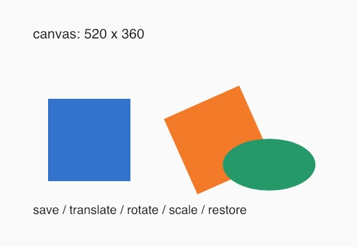
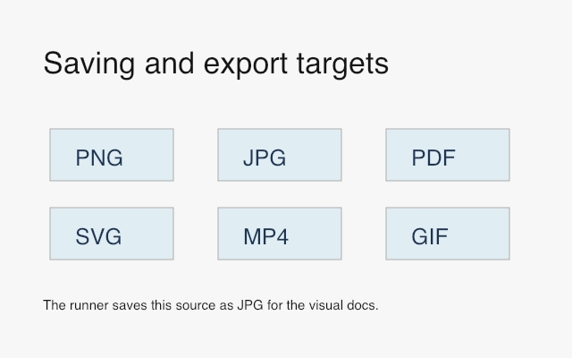

# Canvas

Official DrawBot reference: <https://www.drawbot.com/content/canvas.html>

The canvas API defines page size and exposes coordinate transforms. Save and
restore drawing state around transforms to keep later drawing predictable.

Source:
[`examples/canvas/pages_and_transforms.py`](../examples/canvas/pages_and_transforms.py)

Source:
[`examples/canvas/multiple_pages.py`](../examples/canvas/multiple_pages.py)

Source:
[`examples/canvas/saving_formats.py`](../examples/canvas/saving_formats.py)
