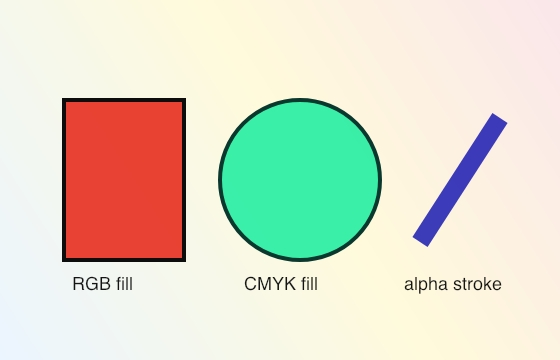
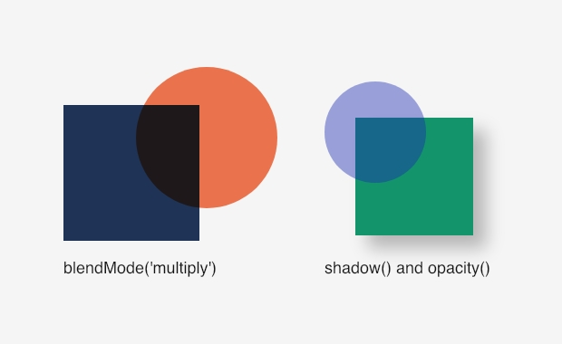

# Colors

Official DrawBot reference: <https://www.drawbot.com/content/color.html>

DrawBot separates fill and stroke state. Colors can be grayscale, RGB, CMYK, or
gradient-backed, and alpha can be applied per color.

Source:
[`examples/colors/fills_strokes_gradients.py`](../examples/colors/fills_strokes_gradients.py)

Source:
[`examples/colors/blend_modes_and_shadows.py`](../examples/colors/blend_modes_and_shadows.py)
