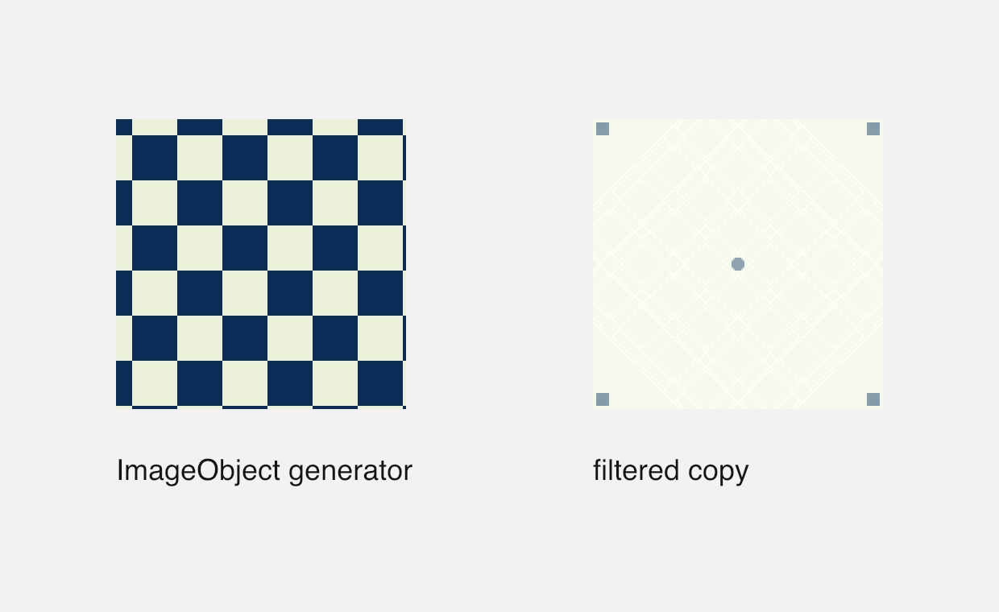
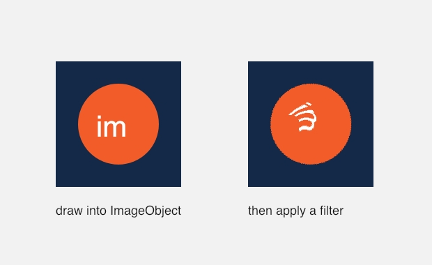
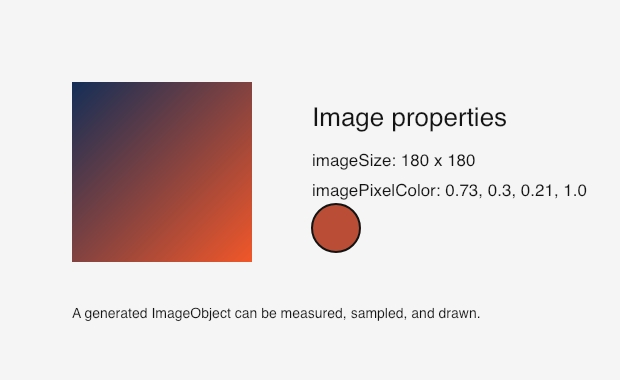
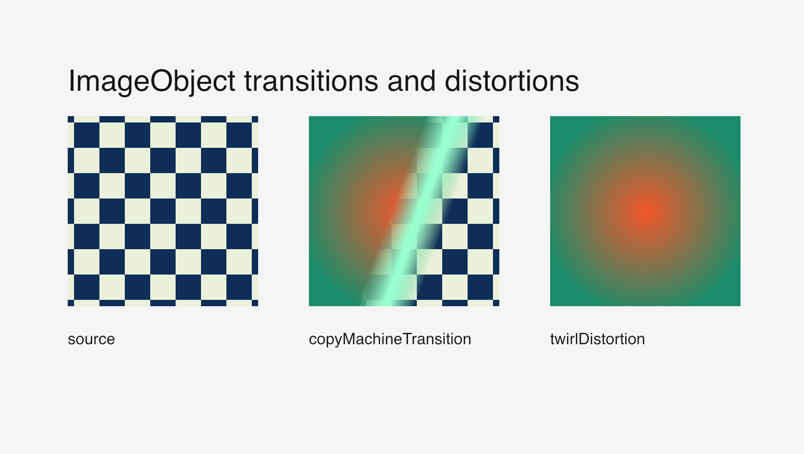
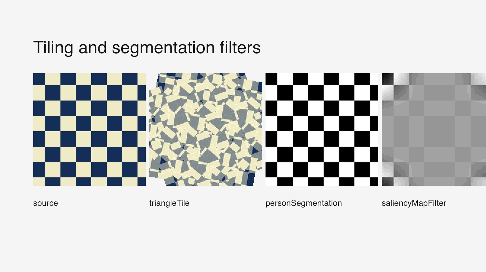

# Images

Official DrawBot reference: <https://www.drawbot.com/content/image.html>

The image APIs draw external images and `ImageObject` instances. `ImageObject`
also exposes a large compatibility surface for Core Image-style generators and
filters.

Source:
[`examples/images/image_object_filters.py`](../examples/images/image_object_filters.py)

Source:
[`examples/images/focused_image_drawing.py`](../examples/images/focused_image_drawing.py)

Source:
[`examples/images/image_properties.py`](../examples/images/image_properties.py)

Source:
[`examples/images/transition_and_distortion.py`](../examples/images/transition_and_distortion.py)

Source:
[`examples/images/tiling_and_segmentation.py`](../examples/images/tiling_and_segmentation.py)
