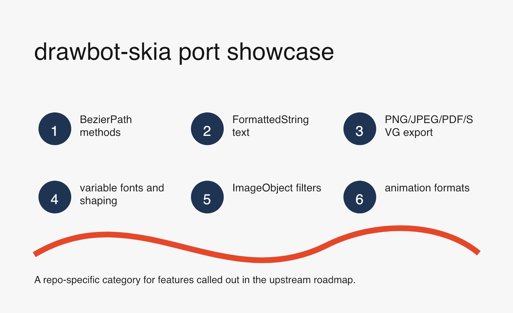
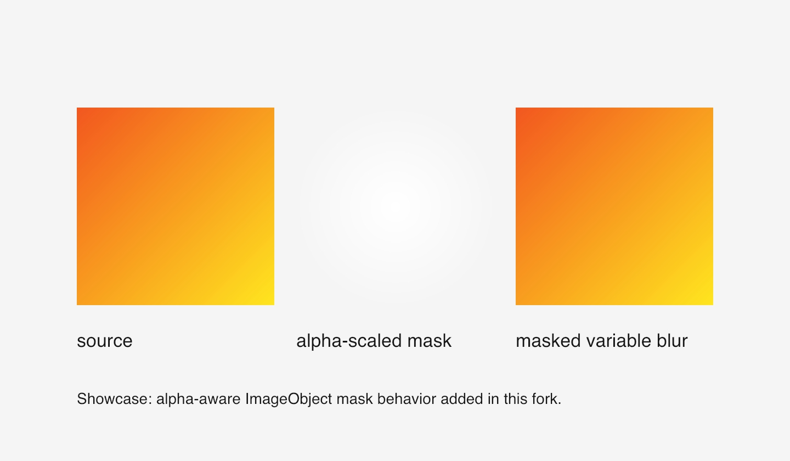
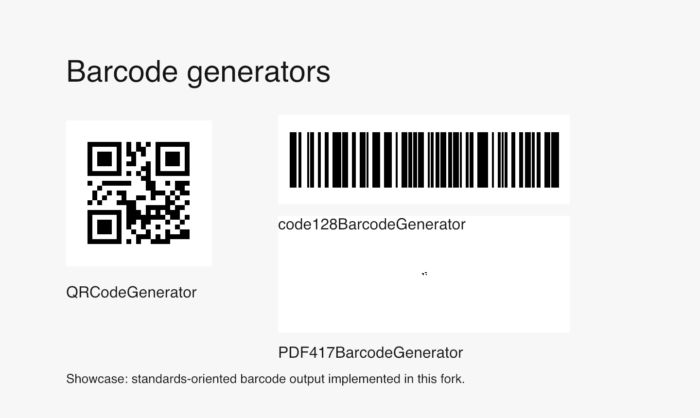
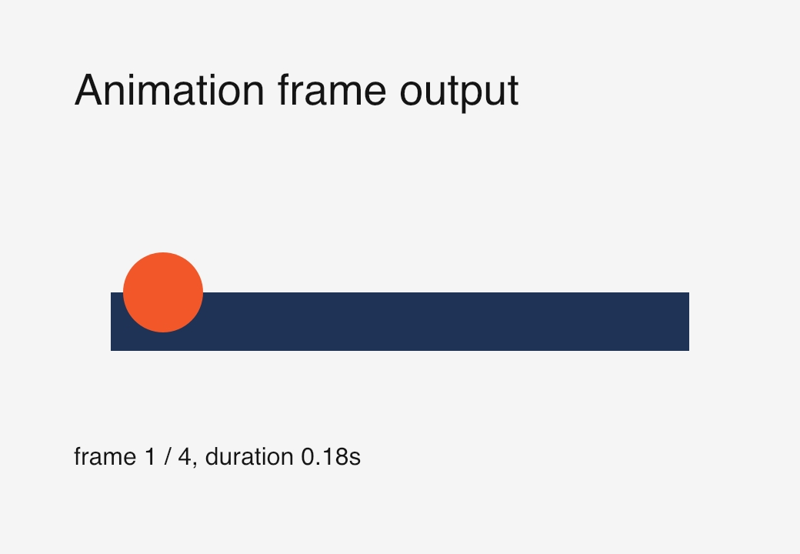
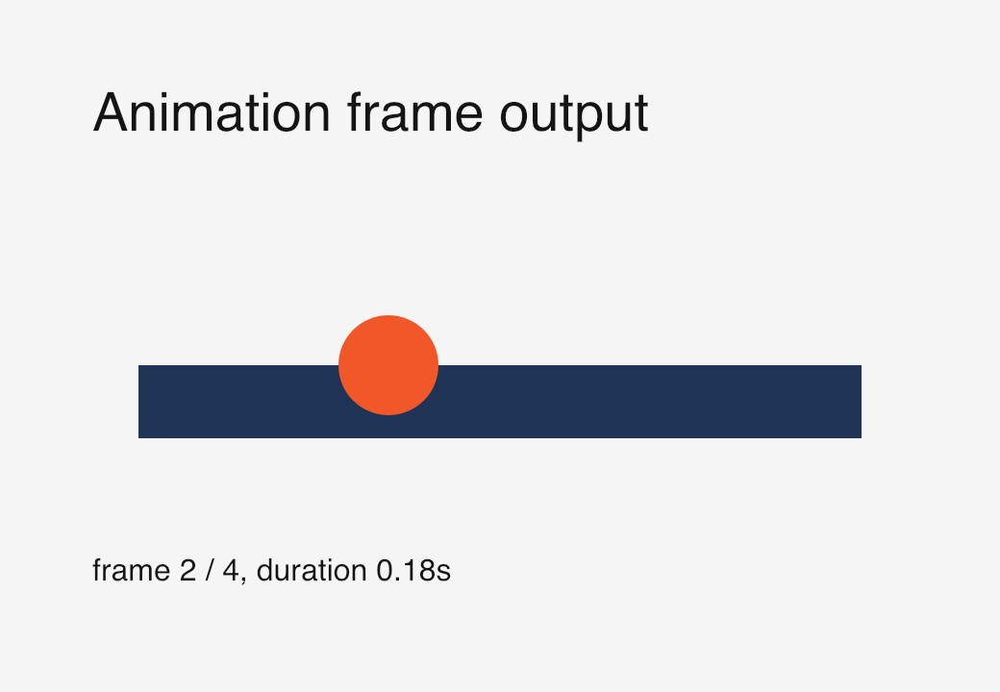
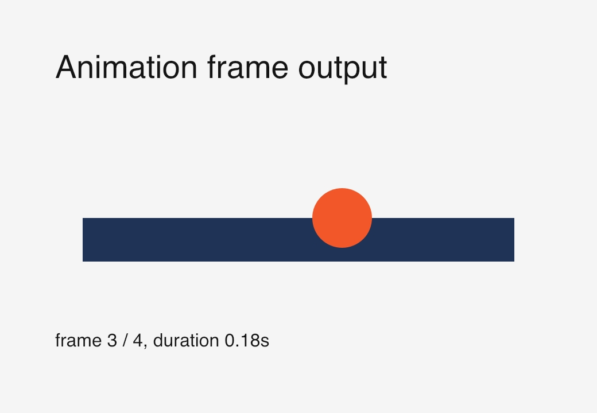
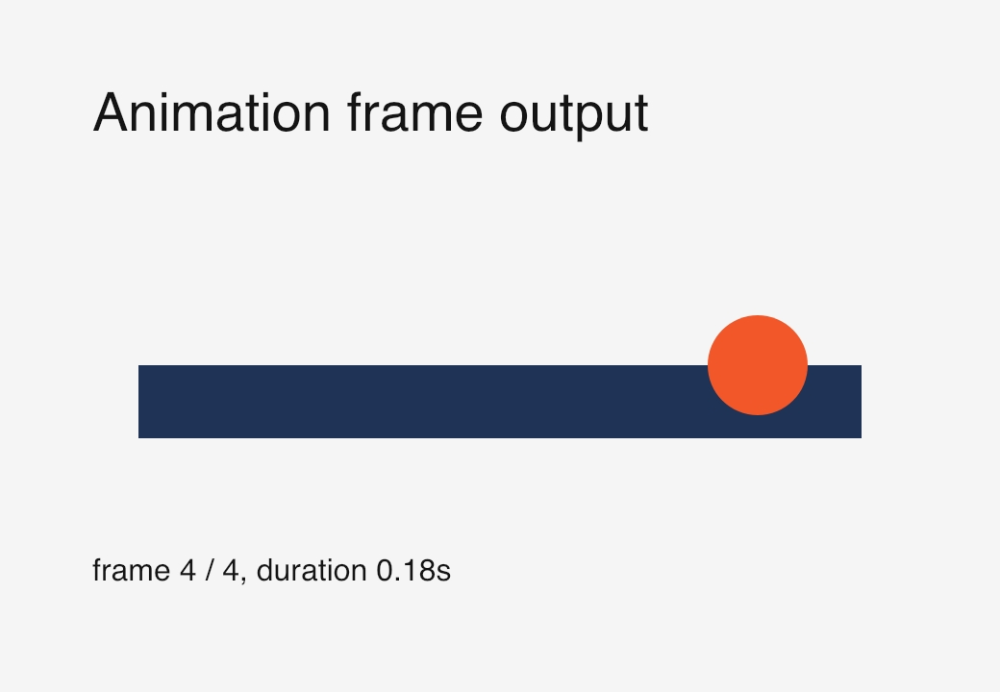

# Port showcase

Upstream roadmap reference:
<https://github.com/justvanrossum/drawbot-skia#roadmap>

This category is specific to this fork. It highlights features that the
upstream roadmap listed as future work or that this fork documents as improved
compatibility behavior.

Source:
[`examples/showcase/implemented_roadmap_features.py`](../examples/showcase/implemented_roadmap_features.py)

Source:
[`examples/showcase/imageobject_alpha_masks.py`](../examples/showcase/imageobject_alpha_masks.py)

Source:
[`examples/showcase/barcode_generators.py`](../examples/showcase/barcode_generators.py)

Source:
[`examples/showcase/animation_frames.py`](../examples/showcase/animation_frames.py)
