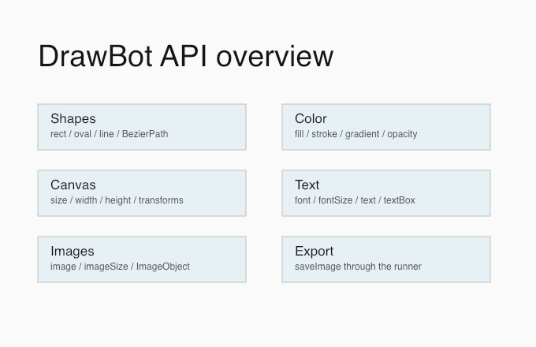

# Quick Reference

Official DrawBot reference: <https://www.drawbot.com/content/quickReference.html>

This local quick reference is intentionally visual: it groups the major API
families covered by the examples and points back to source files that can be
rendered with the local runner.

Source:
[`examples/quick_reference/api_overview.py`](../examples/quick_reference/api_overview.py)
