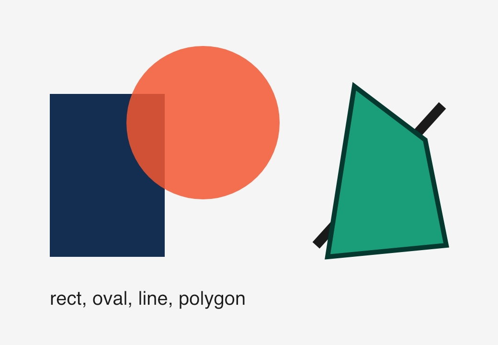
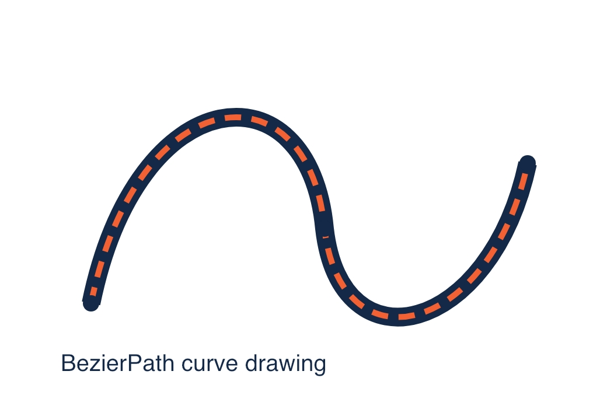
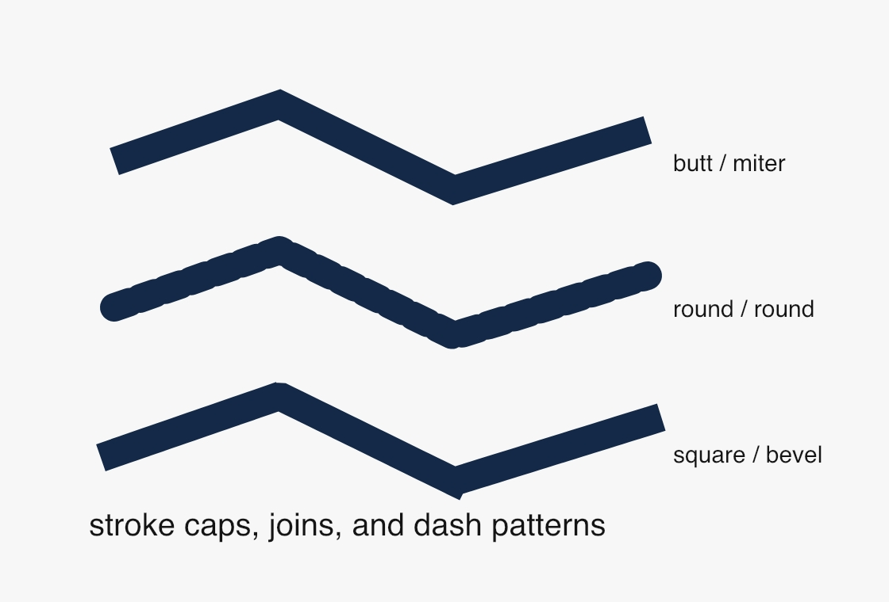
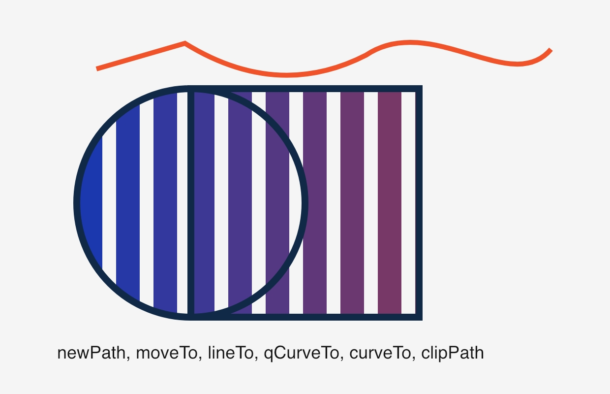
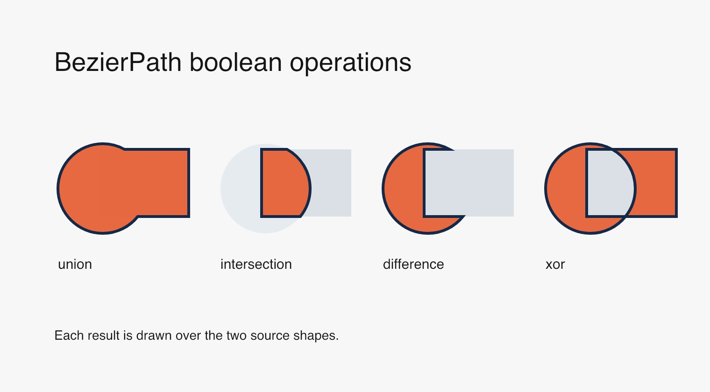

# Shapes

Official DrawBot reference: <https://www.drawbot.com/content/shapes.html>

Shape drawing starts with a canvas, then combines fills, strokes, and geometric
primitives such as `rect()`, `oval()`, `line()`, and `polygon()`. More complex
outlines use `BezierPath`.

Source: [`examples/shapes/basic_shapes.py`](../examples/shapes/basic_shapes.py)

Source: [`examples/shapes/bezier_path.py`](../examples/shapes/bezier_path.py)

Source: [`examples/shapes/path_properties.py`](../examples/shapes/path_properties.py)

Source:
[`examples/shapes/drawing_paths_and_clipping.py`](../examples/shapes/drawing_paths_and_clipping.py)

Source:
[`examples/shapes/path_boolean_operations.py`](../examples/shapes/path_boolean_operations.py)
