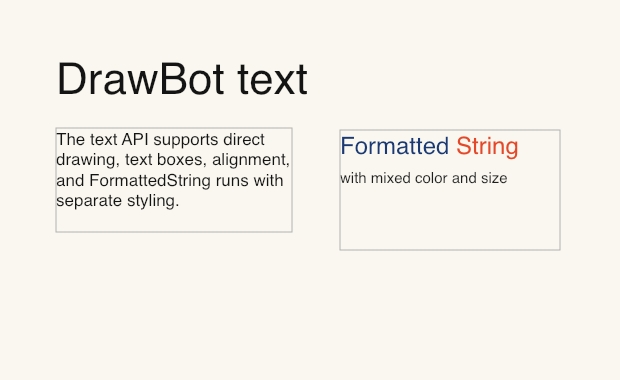
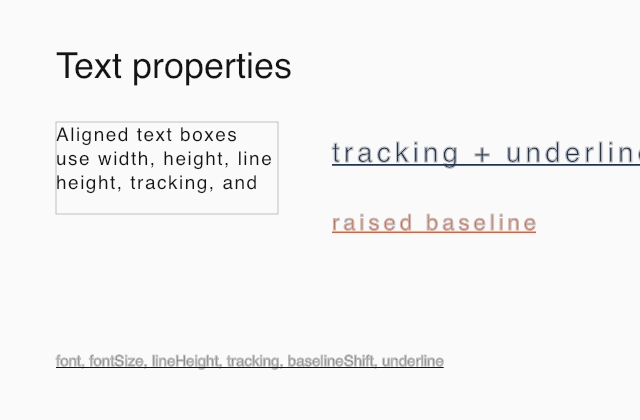
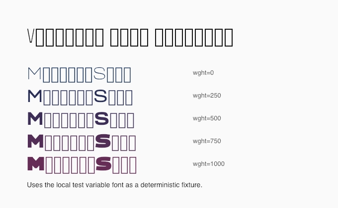
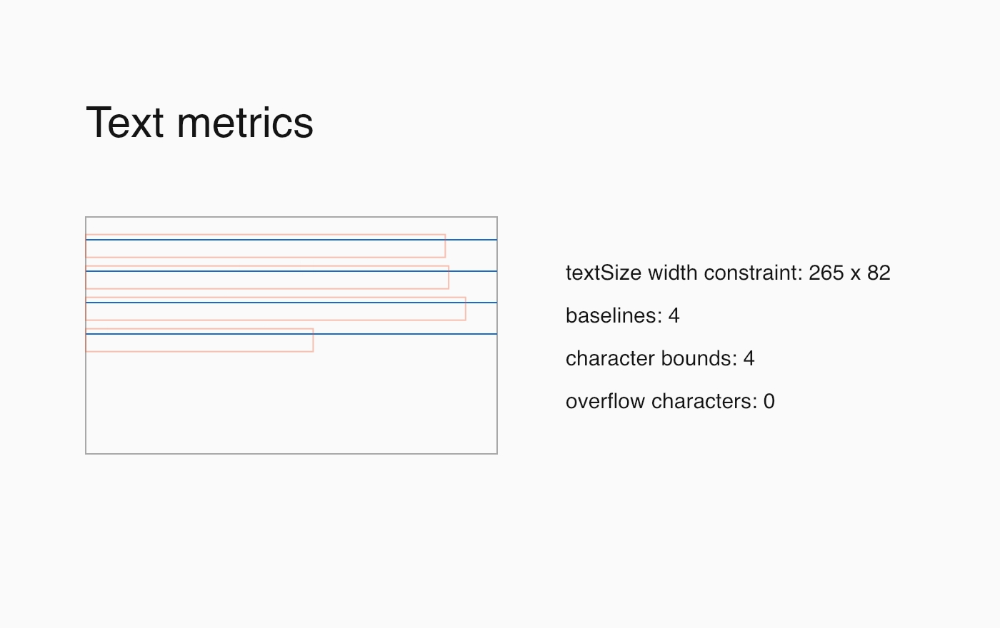
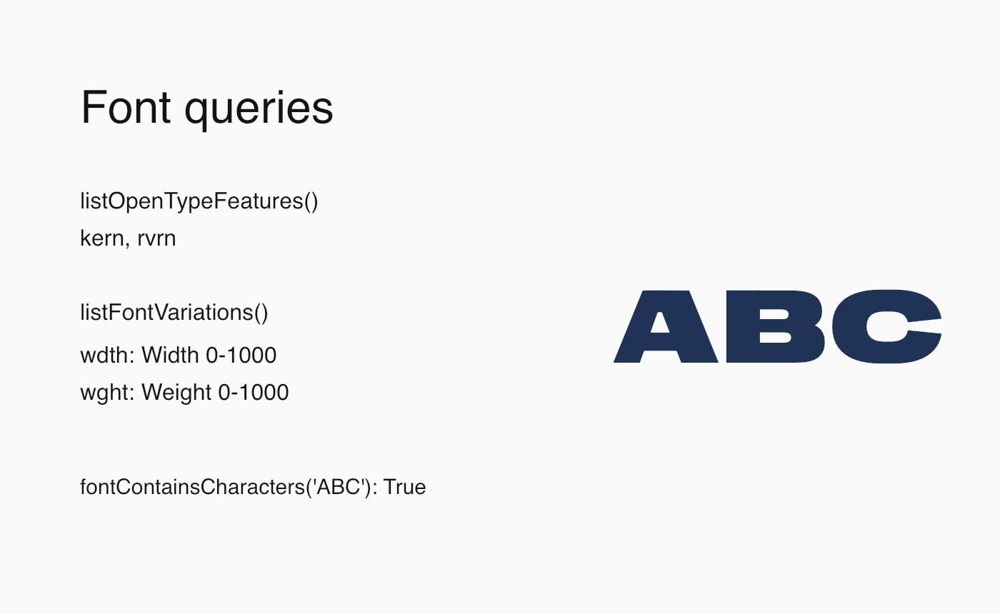

# Text

Official DrawBot reference: <https://www.drawbot.com/content/text.html>

Text can be drawn at a point or inside a box. `FormattedString` carries styling
with the string, making mixed-size and mixed-color runs possible.

Source:
[`examples/text/text_and_formatted_string.py`](../examples/text/text_and_formatted_string.py)

Source:
[`examples/text/text_properties.py`](../examples/text/text_properties.py)

Source:
[`examples/text/font_features.py`](../examples/text/font_features.py)

Source:
[`examples/text/text_metrics.py`](../examples/text/text_metrics.py)

Source:
[`examples/text/font_queries.py`](../examples/text/font_queries.py)
