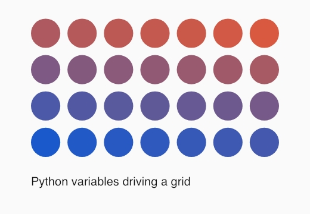
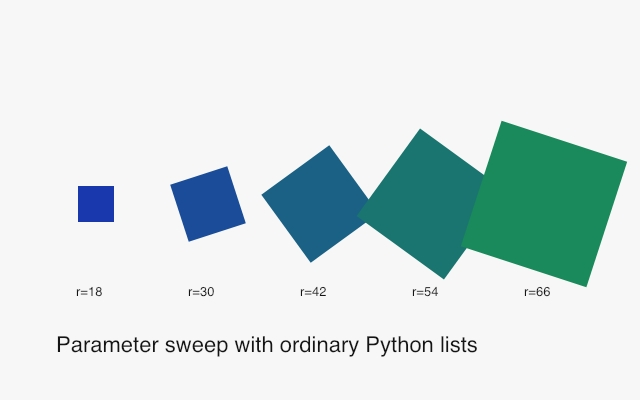

# Variables

Official DrawBot reference: <https://www.drawbot.com/content/variables.html>

The macOS DrawBot application has an interactive `Variable()` UI. This
cross-platform package keeps that app bridge as an explicit compatibility stub,
so repo examples use ordinary Python variables for repeatable visual fixtures.

Source:
[`examples/variables/python_variables.py`](../examples/variables/python_variables.py)

Source:
[`examples/variables/parameter_sweep.py`](../examples/variables/parameter_sweep.py)
